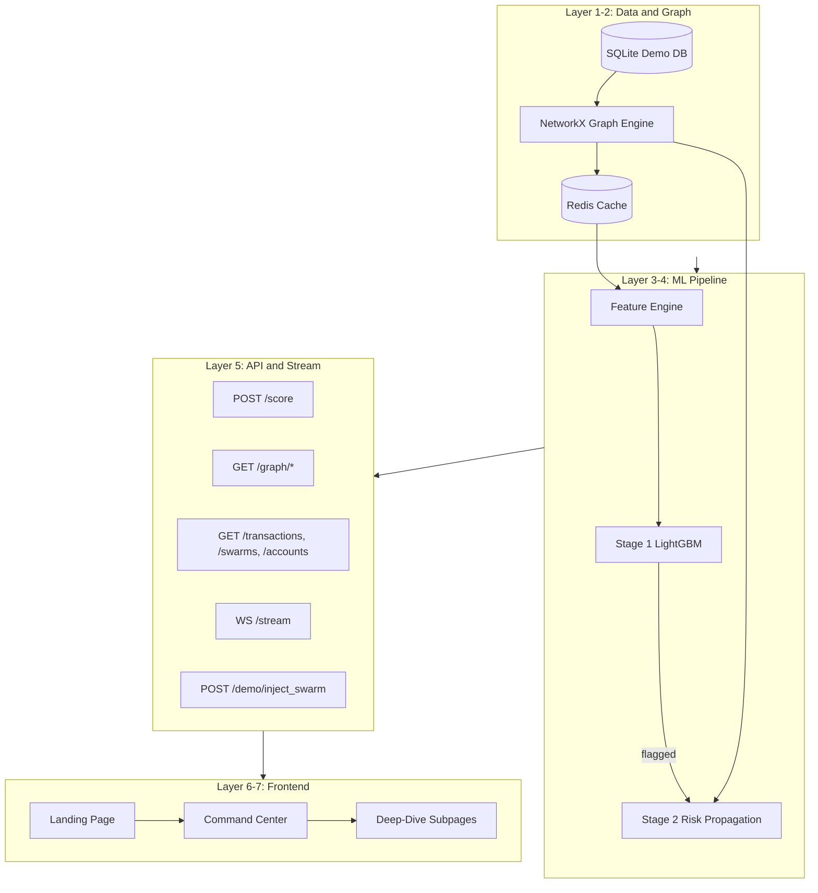

# Dhokha — Master Plan

> **Active focus:** Frontend showcase (tomorrow). Backend/API layers are planned but **deferred** — all dashboard data comes from rich frontend mocks until backend is ready.

Full backend + API spec preserved below for post-showcase integration.

---

## Showcase Strategy

**Goal:** A polished, navigable product demo — landing → dashboard — that tells the fraud-swarm story visually without a live backend.

**Approach:** Mock-first. Build UI against static fixtures + a client-side demo simulator that replays scripted swarm events (Type D especially). Judges see real interactions; data is frontend-owned for now.

**Demo flow for tomorrow:**
1. Landing (`/`) — pitch the problem, show typologies, CTA into dashboard
2. Command Center (`/dashboard`) — pick swarm, watch graph animate, click node for explainability
3. (Optional if time) Swarm Registry or Transaction Feed — prove depth beyond one screen

---

## Phase A — Fix Landing (Do First)

Current landing is ~90% visual polish in [`frontend/src/App.jsx`](frontend/src/App.jsx). Gaps are routing, wiring, and narrative sections.

### A1. Routing scaffold

| Task | Detail |
|------|--------|
| Install `react-router-dom` | Single dependency for tonight |
| Refactor `App.jsx` → router shell | Routes: `/` (landing), `/dashboard/*` |
| Move landing content → `pages/Landing.jsx` | Keep components in `components/landing/` |
| Move `Board`, `Reveal`, `CustomCursor` | `components/landing/` namespace |

### A2. Landing fixes (must-have for showcase)

| Task | File(s) | Detail |
|------|---------|--------|
| Fix page title + meta | `index.html` | Title: "Dhokha — Cross-Bank Fraud Detection"; add description meta |
| Wire primary CTAs | `Landing.jsx` | "See it in action" + "Open the Case" → `<Link to="/dashboard">` |
| Add nav link | `Landing.jsx` nav | "Live Dashboard" → `/dashboard` |
| Logo click → home | nav | `<Link to="/">` on logo |
| Swarm Typologies section | new section after capabilities | 4 cards (A/B/C/D) matching dashboard selector — sets up dashboard story |
| How It Works strip | new section before stats | 3 steps: Transaction → Stage 1 Score (<200ms) → Stage 2 Swarm Detection |
| Lucide icons on case files | `Landing.jsx` | Use already-installed `lucide-react` on FILE 01–03 cards |
| Disable custom cursor on dashboard only | conditional in `App.jsx` | Cursor stays on landing; off on `/dashboard` (graph drag) |

### A3. Landing polish (if time permits)

| Task | Detail |
|------|--------|
| Framer Motion on swarm typology cards | Subtle hover + scroll reveal |
| Animated stat counters | Stats strip counts up on scroll (like `demo.html` ticker) |
| Footer dashboard link | "Open Investigation Dashboard" |
| Remove unused `App.css` boilerplate | Cleanup |

### Landing section order (final)

```
Nav
Hero + Board
#problem — The Blind Spot
#capabilities — Case Files (Speed, Network, Proof)
#typologies — Swarm Patterns A/B/C/D  ← NEW
#how-it-works — 3-step pipeline        ← NEW
Stats strip
#cta — Open the Case
Footer
```

---

## Phase B — Dashboard (After Landing)

### B0. Dependencies (install once landing routing works)

| Package | Purpose |
|---------|---------|
| `react-router-dom` | Already from Phase A |
| `react-force-graph-2d` | Interactive graph — showcase centerpiece |
| `recharts` | SHAP bars, small analytics charts |
| `zustand` | Live demo state (selected node, swarm phase, metrics) |

Defer for post-showcase: `@tanstack/react-table`, `date-fns` (only needed for full subpage tables).

### B1. Mock data layer (build before UI)

Create `frontend/src/api/mock/`:

| File | Contents |
|------|----------|
| `graphNodes.js` | ~15 account nodes, 1 device hub, 4 banks, pre-positioned for Type D demo |
| `graphLinks.js` | Transaction edges with amounts, timestamps |
| `swarms.js` | 4 typology definitions + 1 active demo swarm |
| `metrics.js` | `{ txns_per_sec, active_swarms, value_protected_inr, avg_latency_ms }` |
| `explainability.js` | SHAP feature list per account |
| `transactions.js` | ~30 sample flagged/clean txns for ticker |
| `demoSimulator.js` | **Client-side replay engine** — triggers staged events when user picks a swarm type |

`demoSimulator.js` behavior (no backend needed):
1. User clicks "Type D — Device Cluster"
2. T+0ms: edge pulses fire one-by-one
3. T+800ms: first node amber (Stage 1 flag), latency badge "147ms"
4. T+3500ms: all swarm nodes turn red, toast appears
5. Metrics strip ticks up
6. Explain panel populates on node click

### B2. Dashboard shell

```
frontend/src/
├── pages/dashboard/
│   ├── DashboardLayout.jsx    # Sidebar nav, no custom cursor, dark theme
│   └── CommandCenter.jsx      # Primary showcase page
├── components/dashboard/
│   ├── ForceGraph.jsx
│   ├── SwarmSelector.jsx
│   ├── MetricsStrip.jsx
│   ├── ExplainPanel.jsx
│   ├── LiveTicker.jsx
│   ├── ShapBarChart.jsx
│   └── SwarmToast.jsx
├── store/
│   └── dashboardStore.js      # zustand: graph state, selectedNode, demoPhase
└── api/mock/                  # fixtures + simulator
```

**Routes for tomorrow (minimum):**
- `/dashboard` → Command Center (required)
- `/dashboard/swarms` → stub table with mock data (stretch)
- `/dashboard/transactions` → stub feed (stretch)

Sidebar links to subpages can show "Coming soon" badge if not built — Command Center is the hero.

### B3. Command Center layout

```
┌─────────────────────────────────────────────────────────────────┐
│ METRICS STRIP (mock, ticks on demo events)                       │
├──────────┬──────────────────────────────────────┬───────────────┤
│ SWARM    │                                      │ EXPLAIN       │
│ SELECTOR │     FORCE-DIRECTED GRAPH             │ PANEL         │
│ A B C D  │     bank-colored nodes               │ SHAP bars     │
│          │     amber → red animation            │ stage 1 / 2   │
│ [Reset]  │     edge pulse on txn                │ related accts │
├──────────┴──────────────────────────────────────┴───────────────┤
│ LIVE TICKER — scrolling flagged txns from mock                  │
└─────────────────────────────────────────────────────────────────┘
```

### B4. Graph visual spec

- **Nodes:** circles, color by bank (`--bank-a/b/c`), size by risk score
- **Device node:** smaller, dashed border, center of Type D demo
- **Edges:** gray default; animate stroke color `--string` on pulse
- **States:** `safe` → `flagged` (amber glow) → `swarm` (red + ring highlight)
- **Interaction:** click node → explain panel; hover → account ID tooltip
- **Library:** `react-force-graph-2d` with `cooldownTicks` frozen after layout settles (stable demo)

### B5. Design consistency

Extend [`frontend/src/index.css`](frontend/src/index.css):
- Add `--bank-a/b/c/d` CSS vars
- Add `.dashboard-*` panel classes (paper-card on dark board background)
- Reuse fonts: JetBrains Mono (IDs/metrics), Space Grotesk (headings), Inter (body)
- Command Center background: subtle cork texture from hero, muted

### B6. Stretch goals (only if Phase A + Command Center done)

| Page | Minimum viable for showcase |
|------|----------------------------|
| Swarm Registry | Static table, 5 mock rows, type badges, no filters |
| Transaction Feed | Static table, 20 rows, flagged highlight |
| Account Explorer | Skip for tomorrow |
| Network Analytics | Skip for tomorrow |
| Model Insights | Skip for tomorrow |

---

## Phase C — Backend (Post-Showcase, Unchanged Spec)

Backend layers 1–6 from original plan remain valid. When ready:
1. Implement API endpoints matching mock fixture shapes exactly
2. Swap `demoSimulator.js` for WebSocket `/stream` + REST calls
3. Add Vite proxy in `vite.config.js`

See sections below for full API, data model, and ML pipeline spec.

---

## Tonight's Execution Order

```
1. npm install react-router-dom          (in frontend/)
2. Router shell + move Landing.jsx
3. Landing fixes: title, CTAs, nav, typologies, how-it-works
4. npm install react-force-graph-2d recharts zustand
5. Mock data + demoSimulator.js
6. DashboardLayout + CommandCenter shell
7. ForceGraph with static mock graph
8. SwarmSelector wired to demoSimulator
9. MetricsStrip + ExplainPanel + LiveTicker
10. Polish animations, test full landing → dashboard flow
```

---

## Success Criteria (Tomorrow)

- [ ] Landing loads, all sections render, CTAs navigate to `/dashboard`
- [ ] Swarm Typologies section previews the 4 patterns
- [ ] Dashboard Command Center shows interactive force graph
- [ ] Picking Type D runs scripted demo: pulses → amber → red ring → toast
- [ ] Clicking a flagged node shows SHAP explainability panel
- [ ] Metrics strip updates during demo
- [ ] No broken routes, no console errors, works offline (no backend)
- [ ] Visual continuity: landing aesthetic carries into dashboard

---

# Full Stack Spec (Reference — Backend Deferred)

## Architecture Overview



## API Endpoints (for post-showcase wiring)

| Method | Path | Purpose |
|--------|------|---------|
| GET | `/health` | Status + model loaded |
| POST | `/score` | Transaction scoring <200ms |
| GET | `/graph/subgraph/{account_id}` | Neighborhood for viz |
| GET | `/graph/swarm/{swarm_id}` | Full swarm subgraph |
| GET | `/transactions` | Paginated, filterable feed |
| GET | `/accounts`, `/accounts/{id}` | Account list + detail |
| GET | `/swarms`, `/swarms/{id}` | Swarm registry |
| GET | `/metrics/summary`, `/metrics/latency`, etc. | Dashboard counters/charts |
| POST | `/demo/inject_swarm` | Trigger scripted swarm |
| POST | `/demo/reset` | Reset demo state |
| WS | `/stream` | Live events to dashboard |

## Dashboard Pages (full product, post-showcase)

| Route | Purpose |
|-------|---------|
| `/dashboard` | Command Center — live demo screen |
| `/dashboard/swarms` | Swarm registry table + filters |
| `/dashboard/transactions` | Transaction audit log |
| `/dashboard/accounts/:id` | Account explorer + subgraph |
| `/dashboard/analytics` | Bureau overview charts |
| `/dashboard/model` | SHAP aggregates, model metadata |

## Swarm Typologies (product reference)

| Type | Pattern | Graph signature |
|------|---------|-----------------|
| A | Identity Fan-Out | 1 identity → N accounts across banks |
| B | Mule Fan-In | N victims → 1 collector |
| C | Layering Chain/Ring | Multi-hop path across banks |
| D | Device/IP Cluster | 1 device → unrelated accounts across banks |

Type D is the lead demo — clearest cross-bank value prop.
